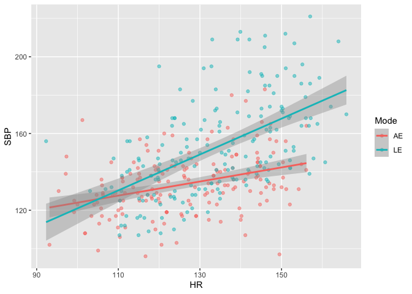

SBP
===

Primary Independent Variables
-----------------------------

-   TargetHR is a factor variable that is the stage of exercise
-   HR (calculated from RPP and SBP) is a continuous variable that is
    the subjects actual mean HR during a particular stage of exercise
-   Mode is a factor variable and either AE (arm ergometry) or LE (leg
    ergometry)

Secondary Independent Variables
-------------------------------

-   Sex (male or female)
-   Age (rather narrow range so not included as a co-variate)

Primary Dependent Variables
---------------------------

-   Systolic Blood Pressure (SBP) (mm Hg)

Systolic Blood Pressure
=======================

SBP Scatterplot
---------------

    sbp10 <- ggplot(data, aes(x = HR, y = SBP, color = Mode)) +
            geom_point(alpha=0.5) +
            stat_smooth(method='lm')
    sbp10

    ## `geom_smooth()` using formula 'y ~ x'

LME - Systolic Blood Pressure
-----------------------------

    sbpBaseline <-lme(SBP ~ 1, random = ~1|ParticNum/HR, data = data, method = "ML")
    sbpHrModel <-lme(SBP ~ HR, random = ~1|ParticNum/HR, data = data, method = "ML")
    sbpFullModel <-lme(SBP ~ HR + Mode, random = ~1|ParticNum/HR, data = data, method = "ML")
    sbpInteractionModel <-lme(SBP ~ HR + Mode + HR:Mode, random = ~1|ParticNum/HR, data = data, method = "ML")

### LME SBP Model Statistics

    anova(sbpBaseline,sbpHrModel,sbpFullModel, sbpInteractionModel)

    ##                     Model df      AIC      BIC    logLik   Test   L.Ratio
    ## sbpBaseline             1  4 3145.153 3160.585 -1568.577                 
    ## sbpHrModel              2  5 2979.862 2999.152 -1484.931 1 vs 2 167.29088
    ## sbpFullModel            3  6 2899.745 2922.892 -1443.872 2 vs 3  82.11754
    ## sbpInteractionModel     4  7 2864.929 2891.934 -1425.465 3 vs 4  36.81586
    ##                     p-value
    ## sbpBaseline                
    ## sbpHrModel           <.0001
    ## sbpFullModel         <.0001
    ## sbpInteractionModel  <.0001

    summary(sbpInteractionModel)

    ## Linear mixed-effects model fit by maximum likelihood
    ##  Data: data 
    ##        AIC      BIC    logLik
    ##   2864.929 2891.934 -1425.464
    ## 
    ## Random effects:
    ##  Formula: ~1 | ParticNum
    ##         (Intercept)
    ## StdDev:    13.43265
    ## 
    ##  Formula: ~1 | HR %in% ParticNum
    ##         (Intercept) Residual
    ## StdDev:    11.46336 5.039526
    ## 
    ## Fixed effects: SBP ~ HR + Mode + HR:Mode 
    ##                 Value Std.Error  DF   t-value p-value
    ## (Intercept)  85.20690  8.356191 312 10.196859       0
    ## HR            0.38327  0.063177 312  6.066725       0
    ## ModeLE      -58.50953 11.793069 312 -4.961349       0
    ## HR:ModeLE     0.55770  0.089785 312  6.211484       0
    ##  Correlation: 
    ##           (Intr) HR     ModeLE
    ## HR        -0.955              
    ## ModeLE    -0.652  0.673       
    ## HR:ModeLE  0.668 -0.700 -0.993
    ## 
    ## Standardized Within-Group Residuals:
    ##          Min           Q1          Med           Q3          Max 
    ## -1.311358641 -0.267614471 -0.009098334  0.244087649  1.524017297 
    ## 
    ## Number of Observations: 350
    ## Number of Groups: 
    ##         ParticNum HR %in% ParticNum 
    ##                35               350

    intervals(sbpInteractionModel, which="fixed")

    ## Approximate 95% confidence intervals
    ## 
    ##  Fixed effects:
    ##                   lower        est.       upper
    ## (Intercept)  68.8595087  85.2068986 101.5542885
    ## HR            0.2596813   0.3832750   0.5068686
    ## ModeLE      -81.5805567 -58.5095307 -35.4385047
    ## HR:ModeLE     0.3820515   0.5577005   0.7333495
    ## attr(,"label")
    ## [1] "Fixed effects:"

    pander(sessionInfo(), compact = FALSE)

**R version 4.0.2 (2020-06-22)**

**Platform:** x86\_64-apple-darwin17.0 (64-bit)

**locale:**
en\_US.UTF-8||en\_US.UTF-8||en\_US.UTF-8||C||en\_US.UTF-8||en\_US.UTF-8

**attached base packages:**

-   stats
-   graphics
-   grDevices
-   utils
-   datasets
-   methods
-   base

**other attached packages:**

-   pander(v.0.6.3)
-   nlme(v.3.1-148)
-   ggplot2(v.3.3.2)
-   dplyr(v.1.0.2)

**loaded via a namespace (and not attached):**

-   Rcpp(v.1.0.5)
-   knitr(v.1.30)
-   magrittr(v.1.5)
-   splines(v.4.0.2)
-   munsell(v.0.5.0)
-   tidyselect(v.1.1.0)
-   lattice(v.0.20-41)
-   colorspace(v.1.4-1)
-   R6(v.2.4.1)
-   rlang(v.0.4.8)
-   stringr(v.1.4.0)
-   tools(v.4.0.2)
-   grid(v.4.0.2)
-   gtable(v.0.3.0)
-   mgcv(v.1.8-31)
-   xfun(v.0.18)
-   withr(v.2.3.0)
-   htmltools(v.0.5.0)
-   ellipsis(v.0.3.1)
-   yaml(v.2.2.1)
-   digest(v.0.6.25)
-   tibble(v.3.0.3)
-   lifecycle(v.0.2.0)
-   crayon(v.1.3.4)
-   Matrix(v.1.2-18)
-   farver(v.2.0.3)
-   purrr(v.0.3.4)
-   vctrs(v.0.3.4)
-   glue(v.1.4.2)
-   evaluate(v.0.14)
-   rmarkdown(v.2.4)
-   labeling(v.0.3)
-   stringi(v.1.5.3)
-   compiler(v.4.0.2)
-   pillar(v.1.4.6)
-   generics(v.0.0.2)
-   scales(v.1.1.1)
-   pkgconfig(v.2.0.3)

<!-- -->

    citation()

    ## 
    ## To cite R in publications use:
    ## 
    ##   R Core Team (2020). R: A language and environment for statistical
    ##   computing. R Foundation for Statistical Computing, Vienna, Austria.
    ##   URL https://www.R-project.org/.
    ## 
    ## A BibTeX entry for LaTeX users is
    ## 
    ##   @Manual{,
    ##     title = {R: A Language and Environment for Statistical Computing},
    ##     author = {{R Core Team}},
    ##     organization = {R Foundation for Statistical Computing},
    ##     address = {Vienna, Austria},
    ##     year = {2020},
    ##     url = {https://www.R-project.org/},
    ##   }
    ## 
    ## We have invested a lot of time and effort in creating R, please cite it
    ## when using it for data analysis. See also 'citation("pkgname")' for
    ## citing R packages.

    citation(package = "dplyr")

    ## 
    ## To cite package 'dplyr' in publications use:
    ## 
    ##   Hadley Wickham, Romain François, Lionel Henry and Kirill Müller
    ##   (2020). dplyr: A Grammar of Data Manipulation. R package version
    ##   1.0.2. https://CRAN.R-project.org/package=dplyr
    ## 
    ## A BibTeX entry for LaTeX users is
    ## 
    ##   @Manual{,
    ##     title = {dplyr: A Grammar of Data Manipulation},
    ##     author = {Hadley Wickham and Romain François and Lionel {
    ##              Henry} and Kirill Müller},
    ##     year = {2020},
    ##     note = {R package version 1.0.2},
    ##     url = {https://CRAN.R-project.org/package=dplyr},
    ##   }

    citation(package = "ggplot2")

    ## 
    ## To cite ggplot2 in publications, please use:
    ## 
    ##   H. Wickham. ggplot2: Elegant Graphics for Data Analysis.
    ##   Springer-Verlag New York, 2016.
    ## 
    ## A BibTeX entry for LaTeX users is
    ## 
    ##   @Book{,
    ##     author = {Hadley Wickham},
    ##     title = {ggplot2: Elegant Graphics for Data Analysis},
    ##     publisher = {Springer-Verlag New York},
    ##     year = {2016},
    ##     isbn = {978-3-319-24277-4},
    ##     url = {https://ggplot2.tidyverse.org},
    ##   }

    citation(package = "nlme")

    ## 
    ## Pinheiro J, Bates D, DebRoy S, Sarkar D, R Core Team (2020). _nlme:
    ## Linear and Nonlinear Mixed Effects Models_. R package version 3.1-148,
    ## <URL: https://CRAN.R-project.org/package=nlme>.
    ## 
    ## A BibTeX entry for LaTeX users is
    ## 
    ##   @Manual{,
    ##     title = {{nlme}: Linear and Nonlinear Mixed Effects Models},
    ##     author = {Jose Pinheiro and Douglas Bates and Saikat DebRoy and Deepayan Sarkar and {R Core Team}},
    ##     year = {2020},
    ##     note = {R package version 3.1-148},
    ##     url = {https://CRAN.R-project.org/package=nlme},
    ##   }
